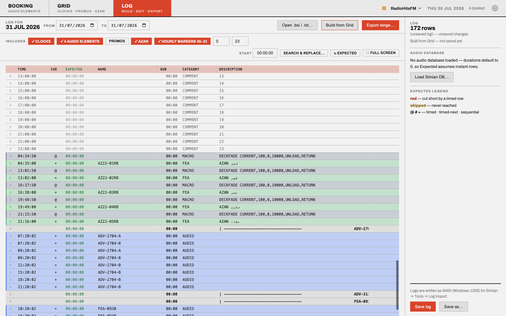
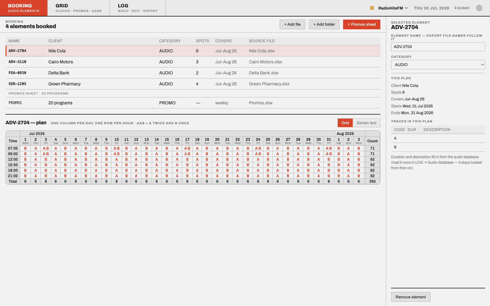
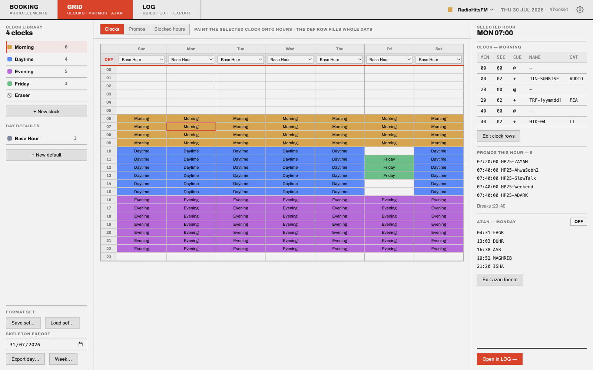
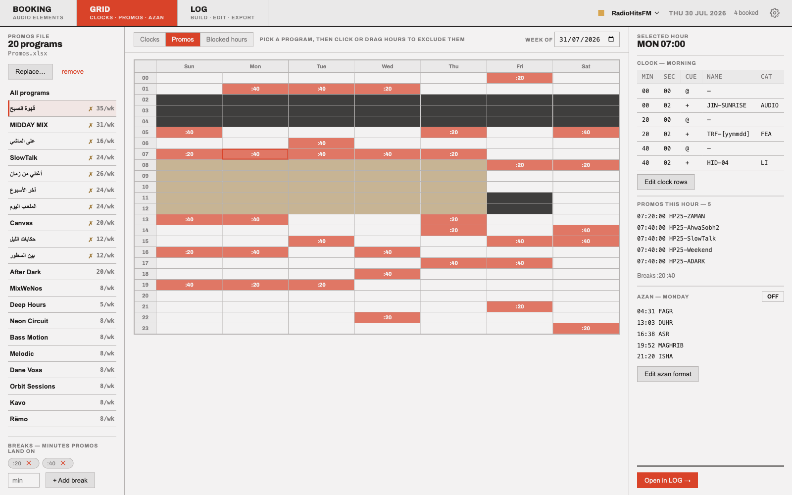
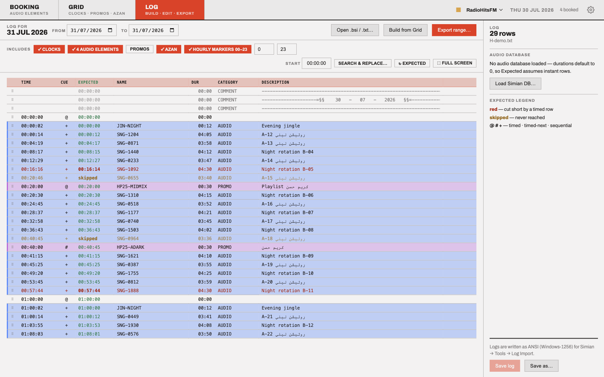
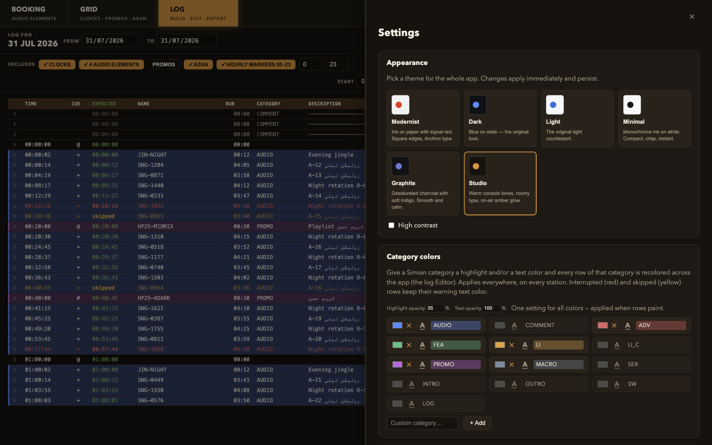

# Radio Scheduler

[](https://github.com/Zezoo123/Radio/actions/workflows/build-windows.yml)
[](https://github.com/Zezoo123/Radio/releases)
[](LICENSE)



A desktop app (Electron + React + TypeScript) that runs the day-to-day playout scheduling of a
group of Egyptian radio stations and speaks the native formats of **BSI Simian Pro** — the playout
automation system the stations broadcast with. It turns the spreadsheets the planning team already
maintains into ready-to-air program logs, distributes program promos automatically under the
station's airing rules, and includes a full log editor that can open Simian's own `.bsi` files and
predict the real air time of every row.

Four stations are built in — **MegaFM, NaghamFM, RadioHitsFM, Sha3byFM** — each with fully
separate data. Pick a station on launch and switch any time from the tab bar.

## Download

Grab the latest Windows build from the [Releases page](https://github.com/Zezoo123/Radio/releases).
Every release carries two artifacts:

- **`Radio Scheduler-Setup-<version>.exe`** — the NSIS installer. Installs per-user (no admin
  rights needed), adds Start-menu and desktop shortcuts, and can be uninstalled normally. Pick
  this for a station PC that will run the app daily.
- **`Radio Scheduler-<version>-portable.exe`** — a single self-contained executable, nothing
  installed. Pick this to try the app out, or to run it on a machine you can't install onto.
  Both variants keep their data in the same place (see _Where data lives_ below).

The build is currently **unsigned**, so the first launch trips Windows SmartScreen with an
"unknown publisher" warning. Click **More info**, then **Run anyway** — it only asks once per
machine. Some browsers also flag the download itself; choose _Keep_ there first.

## What it does, tab by tab

### Booking



_Every booked element in one table; the selected element's full dates × hours plan stays in view._

Load the planning spreadsheets:

- **Element templates** (Excel) — per sponsor/group tables that say exactly when each audio
  element (ads, features, commercial liners…) plays on each calendar day. A cell holds a track
  letter (`A` → file `ADV-1710-A`), several at once (`A B` — both tracks play), or `1` (play the
  bare code once).
- Import files one by one, or point **Add → Audio folder** at a directory and every template in
  it comes in — files that aren't templates are skipped and reported, never fatal.
- The element **code is editable in place**; exported file names derive from it, so a rename
  reaches every preview and export instantly.
- Each template previews as a **plan grid** like the stations' management tool: one column per
  day under a month band, one row per hour, cells like `3A B 2C` (three A's, one B, two C's that
  hour, whatever the minutes), with play counts per row and totals per day. The composed Simian
  text for any date sits behind a toggle.

### Grid — clocks



_Clocks painted onto the 7×24 week; the hour inspector shows the covering clock's rows and the day's azan times._

A Natural Grid–style **clock builder**:

- Build reusable hour _clocks_ (a list of rows with times, cues, names, categories).
- Paint them onto a **7×24 week grid**; per-day _default clocks_ fill every unpainted hour.
- Rows can carry **date tokens** (`[yymmdd]`, `[Day]`, …— with an optional day offset, so
  `[yymmdd-1]` names yesterday's episode), **`{sequential}` tokens** (rotating
  jingle/ID numbers with persisted no-repeat queues), and a **NEXT DAY LOG** row that makes
  Simian load tomorrow's log at 23:59:59.
- A default-clock row can target a **set of hours** (say 07–09 + 16–18) picked in a multi-select
  hour dialog — one row instead of six — any row duplicates with one click (⧉), and **Sort by
  time** reorders a clock's rows by Min:Sec.
- The whole format set can be saved to / loaded from a portable JSON file, which also **bundles
  the sequentials with their rotation counters** so `{tokens}` keep numbering correctly when the
  file is loaded on another PC.

### Grid — promos



_One program's week — blackout, excluded and placed hours; station-blocked hours show black in every grid._

Automatic distribution of program promos from the promos spreadsheet. For every program it reads
the airdays, airtime, promo file name and a per-weekday promo count, then places the promos under
the station's rules:

- never during the program or for 2 hours after it ends (the _blackout_),
- at most one per hour,
- a different spread every day — never the same hours two days running — and different from the
  same weekday last week,
- deterministic per date — the preview always matches the export.

**Station rules** apply on top, per station: **blocked hours** picked per day per hour on a
weekly grid (say the Fagr window, 02–06, or different hours on Friday) that never receive a
promo and show black in every grid, and the station's **break minutes** (e.g. `:20`/`:40`) so
every promo lands exactly on `HH:MM:00` at a break — the randomiser then only chooses hours,
never minutes.

The weekly grid shows every program's placements; click hours to exclude them per weekday, and a
day preview shows the exact rows that will be exported.

### Log — build & export

Compose any date range into a Simian program log: date headers, the Formats clock rows, hourly
comment markers, the computed **AZAN** rows (5 daily prayers, Cairo timetable, format configurable
in Settings), promos, and one section per element template. Preview it, export it to a `.txt` the
station imports via _Simian → Tools → Program Options → Log Import_ — or send it straight to the
Editor. Logs are written as **ANSI (Windows-1256)** so Arabic survives Simian's import; opening a
log auto-detects older UTF-8 files. Every date picker defaults to tomorrow (the day being
scheduled) and the From/To range keeps itself valid.

### Log — editor



_The Expected column simulates the Simian deck: red = cut short by a timed row, yellow = never reached._

A Simian-style log editor:

- Opens exported `.txt` logs **and Simian's native `.bsi` logs** (they are Access databases —
  parsed directly, Arabic text re-decoded, durations read from the file). A text log's **Length
  column** (between Name and Category, Simian's own order) is read into **Dur**; logs without
  one open with durations at zero, as before. Saving writes every row in that same six-column
  shape — the Length cell just stays empty on rows that have no duration (comments, macros), so
  the column layout never varies. Section headers keep their exact pipe art.
- Every cell is editable; rows drag to reorder, duplicate, insert, delete (two-click confirm);
  columns resize like a spreadsheet and remember their widths.
- **Search & replace** across the whole log, scopable to a single column, with live match counts.
- Load the station's **`audio.mdb`** (Simian's audio database) and every row gets its real
  duration; **Update Dur & Desc from DB** also overwrites descriptions from the library (Arabic
  re-decoded correctly). The **Expected** column then simulates the whole day the way the Simian
  deck actually plays it — from 00:00:00, or any start time set in the **Start** field next to
  “Open log” (for logs that begin mid-day):
  - `+` starts when the previous item finishes,
  - `@` fires **exactly** at its scheduled time — cutting whatever is playing (marked **red**) and
    skipping the queue up to it (marked **yellow**),
  - `#` waits for the current item to finish, then jumps straight to itself,
  - a timed row reached early just plays through — a radio station never sits silent.
- Rows are tinted by their Simian category using the colors picked in Settings.

### Settings



_The Settings drawer on the Studio theme — themes, high contrast, and the category color maps._

App-wide preferences (a right-side drawer, open from the gear in the tab bar): **theme**
(Modernist — the default — plus Dark, Light, Minimal, Graphite, Studio, with high-contrast),
**per-category row colors** (highlight and text, with one app-wide opacity % for each), and the
**AZAN format** (the deckfade macro and extra lines emitted around each prayer).

## The Simian log format

Pipe-delimited text, CRLF line endings:

```
HH:MM:SS|<cue>|<NAME>[|Category|Description]   event row
|||COMMENT|<text>                              comment row (date headers, hour markers)
||||| ----…  <CODE>  <Group>                   section header per element group
```

Cues: `+` sequential (play after the previous item), `@` timed-immediate (fire at this exact
time), `#` timed-next (fire after the current item finishes). Timed rows are often bare markers —
a scheduled time with no audio — that steer the playhead.

## Getting started

```bash
npm install
npm run dev        # launch the app in development
npm test           # vitest — unit + golden-file tests
npm run typecheck  # tsc --noEmit
npm run build      # production build
npm run build:win  # Windows installer + portable .exe (dist/)
```

Windows releases are also built by CI: pushing a `v*` tag builds on a real Windows runner and
attaches both `.exe`s to a GitHub Release.

## Where data lives

Everything persists as JSON under Electron's `userData` directory
(Windows: `%APPDATA%/radio-simian-scheduler/`):

| File                                  | Scope       | Contents                                                                                    |
| ------------------------------------- | ----------- | ------------------------------------------------------------------------------------------- |
| `stations/<Station>/formats.json`     | per station | clocks, default clocks, week grid                                                           |
| `stations/<Station>/promos.json`      | per station | imported promo set, hour exclusions, time overrides, station rules (blocked hours + breaks) |
| `stations/<Station>/sequentials.json` | per station | sequential definitions + rotation queues                                                    |
| `azan-format.json`                    | global      | the AZAN row format                                                                         |
| `ui-settings.json`                    | global      | category colors                                                                             |
| `simian-db.json`                      | global      | remembered path of the loaded Simian `audio.mdb`, reloaded on startup                       |

## Reading the code

Start with **[docs/ARCHITECTURE.md](docs/ARCHITECTURE.md)** — a guided runthrough of the whole
codebase: the process model, every module, how a day gets composed into a log, the playout
simulation rules, and the file formats (including Simian's `.bsi` and `audio.mdb`).

The short version:

```
src/main/core/     pure TypeScript domain logic — no Electron, fully unit-tested
src/main/          Electron main process: session state, IPC, persistence stores
src/preload/       the typed contextBridge (window.api)
src/renderer/      the React UI (one view per tab)
test/              vitest suites + golden fixtures (byte-exact output tests)
```
